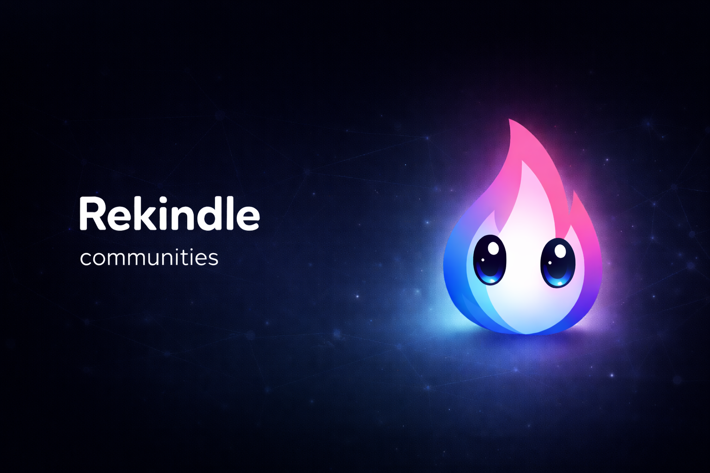

<p align="center">
  
</p>

**A decentralized gaming chat app — no servers, no accounts, no tracking.**

Rekindle is a peer-to-peer desktop chat application built with
[Tauri 2](https://v2.tauri.app/) and the [Veilid](https://veilid.com/) network.
It provides end-to-end encrypted messaging, community channels, voice chat, and
game detection without any central server. Visually inspired by the classic
[Xfire](https://en.wikipedia.org/wiki/Xfire) gaming client.

## Why Rekindle?

Gaming chat is dominated by centralized platforms that harvest data, require
accounts, and control your social graph. Rekindle takes a different approach:

- **No servers** — messages route peer-to-peer over the Veilid network. There is
  nothing to shut down, no terms of service, and no single point of failure.
- **No accounts** — your identity is an Ed25519 keypair generated locally on your
  machine. No email, no phone number, no username/password sent anywhere.
- **No tracking** — Veilid's safety routes hide sender IP, private routes hide
  receiver IP. No central server logs who talks to whom.
- **Real encryption** — four layers deep. Signal Protocol (Double Ratchet) for
  1:1 messages, AES-256-GCM group keys for community channels, XChaCha20-Poly1305
  transport encryption on the wire, and Stronghold vault encryption at rest.

## Features

### Messaging
- End-to-end encrypted 1:1 chat via Signal Protocol (X3DH + Double Ratchet)
- Separate chat windows per conversation (classic IM style, not tabbed)
- Typing indicators, read receipts, message history persisted in SQLite
- Offline message queue — messages retry automatically when a peer comes online
- Cap'n Proto wire format for compact, zero-copy serialization

### Communities
- Create or join communities with text and voice channels
- Role-based permissions (owner, admin, moderator, member)
- Invite by code, member management, channel CRUD
- Group encryption via per-channel Media Encryption Keys (AES-256-GCM)

### Voice Chat
- Opus codec at 48kHz mono with voice activity detection
- Adaptive jitter buffer and multi-participant audio mixer
- Dedicated audio threads (cpal capture/playback) with mpsc transport
- Global shortcut mute toggle (Ctrl+Shift+M)

### Game Detection
- Cross-platform process scanning (Windows, macOS, Linux)
- JSON game database mapping process names to game metadata
- "Playing: Game Name" status published to your DHT profile
- Friends see what you're playing in real time on their buddy list

### Identity and Security
- Ed25519 keypair identity — no central authority, no registration
- Stronghold vault (AES-256-GCM + Argon2id KDF) protects private keys
- Signal Protocol sessions established via DHT-published PreKeyBundles
- Trust-on-first-use (TOFU) with optional out-of-band key verification
- Four-layer encryption stack (see [docs/security.md](docs/security.md))

### Desktop Integration
- Frameless skinned windows with custom titlebar (classic IM aesthetic)
- System tray with status controls (online, away, busy, offline)
- Friend groups, nicknames, avatars
- Single-instance enforcement, autostart, system notifications
- Multi-identity support (multiple profiles on one machine)

## Architecture

Rekindle is structured as a four-layer stack:

```
┌─────────────────────────────────────────────────────────┐
│                     SolidJS Frontend                    │
│  Windows, components, stores, handlers, styles          │
├─────────────────────────────────────────────────────────┤
│                   Tauri 2 IPC Bridge                    │
│  Commands (Frontend→Rust), Events (Rust→Frontend)       │
│  Window management, system tray, plugins                │
├─────────────────────────────────────────────────────────┤
│                   Pure Rust Crates                      │
│  rekindle-protocol   rekindle-crypto                    │
│  rekindle-game-detect   rekindle-voice                  │
├─────────────────────────────────────────────────────────┤
│                    Veilid Network                       │
│  DHT storage, app_message routing, private routes       │
│  XChaCha20-Poly1305 transport encryption                │
└─────────────────────────────────────────────────────────┘
```

The frontend holds no business logic — it renders state and forwards user actions.
All cryptography, networking, and protocol handling lives in pure Rust crates with
zero Tauri dependency, ensuring they can be tested independently and reused outside
the desktop shell.

## Tech Stack

| Layer           | Technology                                                        |
|-----------------|-------------------------------------------------------------------|
| App Framework   | [Tauri 2](https://v2.tauri.app/) (Rust + webview)                 |
| Frontend        | [SolidJS](https://www.solidjs.com/) + [Tailwind 4](https://tailwindcss.com/) |
| Network         | [Veilid](https://veilid.com/) (DHT storage, P2P message routing) |
| Encryption      | Signal Protocol ([libsignal](https://github.com/nicemicro/libsignal)), XChaCha20-Poly1305, AES-256-GCM |
| Serialization   | [Cap'n Proto](https://capnproto.org/) (wire format)              |
| Voice           | [Opus](https://opus-codec.org/) codec, [cpal](https://github.com/RustAudio/cpal) audio I/O |
| Storage         | SQLite (chat history), [Stronghold](https://github.com/nicemicro/stronghold.rs) (encrypted vault), DHT (presence/keys) |
| Dev Environment | [Konductor](https://github.com/braincraftio/konductor) (Nix flake) |

## Project Structure

```
src/                           Frontend (SolidJS + Tailwind 4)
  windows/                     One component per Tauri window
  components/                  Reusable UI (titlebar, buddy-list, chat, voice)
  stores/                      SolidJS reactive state
  ipc/                         Typed invoke() wrappers, event subscriptions
  handlers/                    Named event handler functions
  styles/                      Global CSS (@apply, no inline utilities)

src-tauri/                     Tauri 2 Rust backend
  src/
    lib.rs                     App entry, plugin registration, setup
    commands/                  IPC command handlers (auth, chat, friends, voice, ...)
    channels/                  Event type definitions (chat, presence, voice, notification)
    services/                  Background services (veilid, messaging, presence, sync, game)
  migrations/                  SQLite schema (001_init.sql)

crates/
  rekindle-protocol/           Veilid networking, DHT records, Cap'n Proto codec
  rekindle-crypto/             Ed25519 identity, Signal Protocol, group encryption (MEK)
  rekindle-game-detect/        Cross-platform process scanning, game database
  rekindle-voice/              Opus encode/decode, audio capture/playback, VAD, jitter buffer

schemas/                       Cap'n Proto schema definitions (.capnp)
```

## Getting Started

### Prerequisites

- Rust 1.92+ (via [rustup](https://rustup.rs/))
- Node.js 22+ with [pnpm](https://pnpm.io/)
- [Cap'n Proto](https://capnproto.org/) compiler (`capnp`)
- CMake
- Platform-specific Tauri 2 dependencies (see below)

**Linux (Debian/Ubuntu/Pop!_OS):**

```bash
# Rust
curl --proto '=https' --tlsv1.2 -sSf https://sh.rustup.rs | sh
source "$HOME/.cargo/env"

# Node.js LTS
curl -fsSL https://deb.nodesource.com/setup_lts.x | sudo -E bash -
sudo apt install -y nodejs
sudo npm install -g pnpm

# System dependencies
sudo apt install -y build-essential pkg-config curl wget cmake capnproto \
  libwebkit2gtk-4.1-dev libgtk-3-dev libsoup-3.0-dev \
  libjavascriptcoregtk-4.1-dev libayatana-appindicator3-dev \
  libssl-dev libasound2-dev libopus-dev libsodium-dev
```

**macOS:**

```bash
xcode-select --install
brew install capnp cmake libsodium opus
```

Rust and Node.js are also required on macOS — install via [rustup](https://rustup.rs/)
and [nvm](https://github.com/nvm-sh/nvm) or [Homebrew](https://brew.sh/) (`brew install node`),
then `npm install -g pnpm`.

**Nix (optional dev environment):**

A `flake.nix` is included for [Nix](https://nixos.org/) users. It extends the
[Konductor](https://github.com/braincraftio/konductor) `frontend` devshell with
Rekindle-specific build deps. To use it, uncomment `use flake` in `.envrc` and
run `direnv allow`, or enter the shell manually with `nix develop`.

### Development

```bash
# Install frontend dependencies
pnpm install

# Run in development mode (hot-reload for both frontend and Rust)
pnpm tauri dev

# Production build
pnpm tauri build
```

### Testing

```bash
# Rust unit tests (all workspace crates)
cargo test --workspace

# E2E tests (real Rust backend + Playwright)
pnpm test:e2e

# Mock IPC tests (frontend only, stubbed responses)
pnpm test:mock

# Lint
cargo clippy --workspace -- -D warnings
pnpm tsc --noEmit
```

## How It Works

**Adding a friend:** Share your public key out-of-band (paste, QR code, or deep
link). The recipient sends a friend request over Veilid. Once accepted, both sides
establish a Signal Protocol session via PreKeyBundles published to the DHT, and
messaging begins.

**Sending a message:** Plaintext is encrypted with the Signal Protocol Double
Ratchet, signed with Ed25519, serialized into a Cap'n Proto envelope, and delivered
via `app_message()` through Veilid's routed network. The receiver's callback
decrypts, verifies, stores in SQLite, and emits an event to the frontend.

**Presence:** Each user publishes their status, display name, avatar, and game info
to an 8-subkey DHT profile record. Friends subscribe with `watch_dht_values` and
receive push notifications when any subkey changes.

**Offline delivery:** When a peer is unreachable, messages queue in SQLite. A
background sync service retries delivery every 30 seconds until the peer comes
online (up to 20 attempts).

## Documentation

| Document | Description |
|----------|-------------|
| [architecture.md](docs/architecture.md) | System architecture, layer responsibilities, data flow diagrams |
| [protocol.md](docs/protocol.md) | Veilid integration, message lifecycle, DHT record layouts |
| [security.md](docs/security.md) | Four-layer encryption stack, identity model, threat analysis |
| [data-layer.md](docs/data-layer.md) | SQLite schema, Stronghold vault, DHT record layout |
| [frontend.md](docs/frontend.md) | SolidJS frontend, routing, stores, IPC layer |
| [crates.md](docs/crates.md) | Pure Rust crate reference (protocol, crypto, game-detect, voice) |
| [tauri-backend.md](docs/tauri-backend.md) | Tauri commands, events, services, state management |
| [development.md](docs/development.md) | Build commands, testing, code conventions |
| [roadmap.md](docs/roadmap.md) | Implementation phases and completion status |

## License

[MIT](LICENSE)

## Acknowledgments

- [Xfire](https://en.wikipedia.org/wiki/Xfire) — the original gaming chat client that inspired this project
- [Veilid](https://veilid.com/) — the P2P network powering Rekindle
- [Konductor](https://github.com/braincraftio/konductor) — reproducible dev environments
